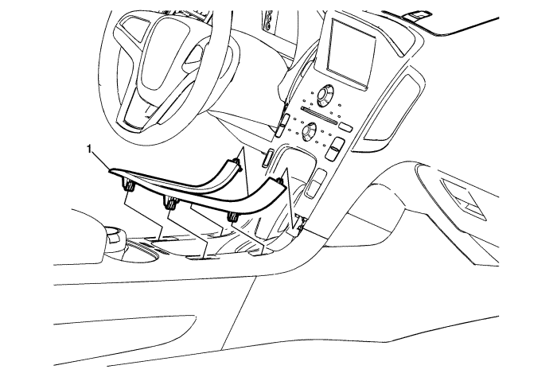
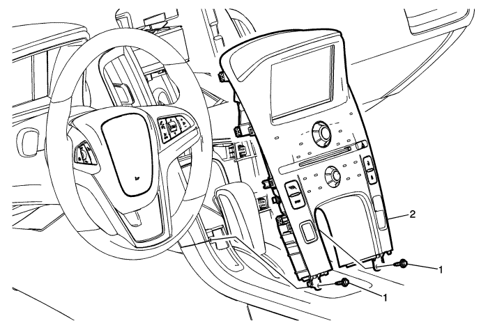
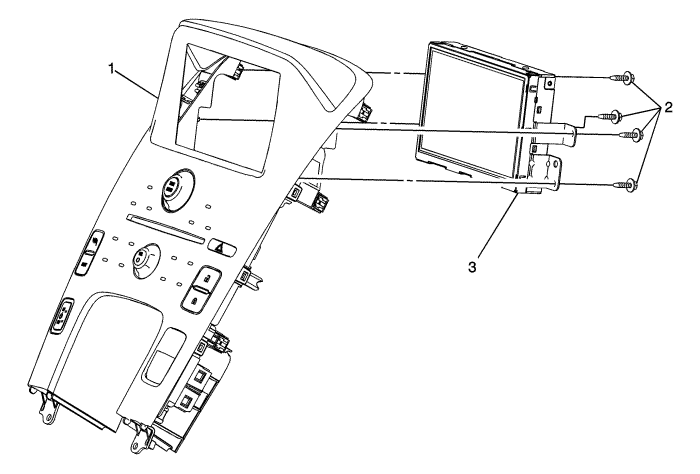
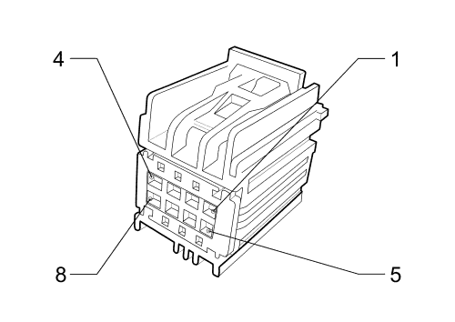

# Volty Pi

Integrate Raspberry Pi into Chevy Volt's infotainment system

## Disclaimer

All information in this repository was gathered in good faith and is for educational purposes only. It is not intended to harm or violate any person's or company's rights.

Source code and configuration are under [MIT License](./LICENSE.md)

---

# Chevy Volt Infotainment Display Module

The infotainment display module consists of:
- LCD
- Backlight (attached to LCD)
- Touchscreen (attached to LCD)
- Controller board

## Accessing the infotainment display module

1. Remove the front floor console applique (using a flat plastic tool) 
2. Remove the radio control assembly 
3. Remove the infotainment display module 

## LCD

Feature      | Value
------------ | -----
Manufacturer | AU Optronics (AUO)
Model        | C070VW04-V0
Size         | 7"
Resolution   | 800×480 (WVGA) 133PPI
Interface    | 18-bit parallel RGB over 50 pins FPC ribbon
Power Supply | 3.3/12.5/15.0/-9.0V (VDD/AVDD/VGH/VGL)

[C070VW04-V1 datasheet](./C070VW04-V1.pdf) 

This datasheet is for C070VW04-**V1**, so some values are incorrect and noted as such below.

## LCD Ribbon Interface

50-pin ribbon pinout (from C070VW04-V1 datasheet)

Pin | Name | I/O | Description                           | Vmin | Vmax |     V |  mA
--- | -----| --- | ------------------------------------- | ---- | ---- | ----- | ---
1   | VCOM | PI  | Common electrode driving voltage      |      |      |  5.31 | 0.3
2   | VGH  | PI  | Positive power supply voltage for TFT | -0.3 |   20 |    15 | 0.2
3   | VGL  | PI  | Negative power supply voltage for TFT |  -15 |  0.3 |    -9 | 0.2
4   | VDD  | PI  | Digital power supply voltage          |  0.3 |  4.5 |   3.3 | 8.7
5   | GND  | PI  | Ground                                |      |      |     0
6   | V1   | I   | Gamma correction voltage              |      |      | 12.24
7   | V2   | I   | Gamma correction voltage              |      |      | 11.62
8   | V3   | I   | Gamma correction voltage              |      |      | 10.40
9   | V4   | I   | Gamma correction voltage              |      |      |  9.78
10  | V5   | I   | Gamma correction voltage              |      |      |  9.38
11  | V6   | I   | Gamma correction voltage              |      |      |  8.46
12  | V7   | I   | Gamma correction voltage              |      |      |  6.83
13  | V8   | I   | Gamma correction voltage              |      |      |  6.40
14  | V9   | I   | Gamma correction voltage              |      |      |  4.58
15  | V10  | I   | Gamma correction voltage              |      |      |  3.74
16  | V11  | I   | Gamma correction voltage              |      |      |  3.27
17  | V12  | I   | Gamma correction voltage              |      |      |  2.60
18  | V13  | I   | Gamma correction voltage              |      |      |  1.18
19  | V14  | I   | Gamma correction voltage              |      |      |  0.28
20  | AVDD | PI  | Analog power supply voltage           | -0.5 | 13.5 |  12.8 | 34
21  | AVDD | PI  | Analog power supply voltage           | -0.5 | 13.5 |  12.8 | 34
22  | GND  | PI  | Ground                                |      |      |     0
23  | VS   | I   | Vertical Sync input
24  | HS   | I   | Horizontal Sync input
25  | DE   | I   | Data Enable Input (Low Active)
26  | DCLK | I   | Data clock Input
27  | GND  | PI  | Ground                                |      |      |     0
28  | DB5  | I   | Blue data input(MSB)
29  | DB4  | I   | Blue data input
30  | DB3  | I   | Blue data input
31  | DB2  | I   | Blue data input
32  | DB1  | I   | Blue data input
33  | DB0  | I   | Blue data input(LSB)
34  | DG5  | I   | Green data input (MSB)
35  | DG4  | I   | Green data Input
36  | DG3  | I   | Green data Input
37  | DG2  | I   | Green data Input
38  | DG1  | I   | Green data Input
39  | DG0  | I   | Green data Input (LSB)
40  | DR5  | I   | Red data input (MSB)
41  | DR4  | I   | Red data input
42  | DR3  | I   | Red data Input
43  | DR2  | I   | Red data Input
44  | DR1  | I   | Red data Input
45  | DR0  | I   | Red data Input (LSB)
46  | Mode | I   | DE/SYNC mode selection. "H" for DE mode. "L" for HV mode.
47  | STBY | I   | Standby mode. "H" for normal operation. "L" for standby mode.
48  | RSTB | I   | Global reset pin. (low active)
49  | GND  | PI  | Ground                                |      |      |     0
50  | VCOM | PI  | Common electrode driving voltage      |      |      |  5.31 | 0.3

## LED Backlight

LED backlight is 12 LEDs (3 strings of 4 LEDs each).

Connector is 4 wires: Red is the anode (+24V), the other 3 are cathodes

Feature     | Value             | Note
----------- | ----------------- | ----
Connector   | JST SM04B-SRSS-TB
Pins        | BLE-4PINS-ACCC    | (+) (-) (-) (-)
Voltage     | 24V               | *datasheet for V1 says 14V @ 80mA - this is incorrect*
Max Voltage | 25.5V is OK       | *datasheet for V1 says 16V @ 90mA - this is incorrect*

## Touchscreen

Touchscreen is a standard resistive touchscreen with a 4-pin ribbon connector. 
Works well with Adafruit's [AR1100 Touchscreen To USB Mouse Controller](https://www.adafruit.com/product/1580)

## Display Controller Board

Controller board itself does not have any identifiable model or part number. It might be custom-made for Chevrolet. It has the following connectors:
- 50-pin ribbon connector to the display module
- 4-pin ribbon connector to the touch module
- 4-pin plug connector to display's LCD backlight
- 8-pin plug connector (P17 X1 connector) to the main radio unit and the rest of the vehicle
- 3-pin GVIF connector to the main radio unit

### Connectors

```
+-----------------------------------------------------+
|                                                     |
| Controller Board                                    |
|                                                     |
|                   P17 X1 Connector (7283-9028-30)   |
| +------+        +---------------------------------+ |
| |      |        | [BATT ] [ GND ] [ GND ] [CGI+ ] | |
| | GVIF |        |                                 | |
| |      |        | [W RST] [P ENB] [C SHL] [CGI- ] | |
| +------+        +---------------------------------+ |
|                                                     |
+-----------------------------------------------------+
```

### GVIF Connector

The blue connector on the display controller is for Gigabit Video Interface (GVIF). GVIF transmits video data over a single shielded twisted pair using [FPD-Link II](https://en.wikipedia.org/wiki/FPD-Link#FPD-Link_II) protocol which uses low-voltage differential signaling (LVDS). GVIF connector has 3 pins, but the connector shape might be unique to a specific display controller, vehicle model or series.

*I was not able to find GVIF connectors on sale on any OEM site or eBay*
*Although, GM might use the same connector as Toyota. GVIF connector for Land Rover that I purchased does not fit properly.*

### GVIF Video Decoder Chip

Smaller chip on the display controller board next to the GVIF connector is CXB1466R video decoder chip. It converts FPDLink-II signal sent over GVIF to parallel 24-bit RGB signal. *(interestingly, LCD display interface is only 18 bits)*

[Datasheet for decoder CXB1456R (sister chip)](./CXB1456R.pdf)

*AFAIK, the complementary encoder chip is CXB1465R.*

[Datasheet for encoder CXB1455R (sister chip)](./CXB1455R.pdf)

*GVIF and CXB\* encoder/decoder chips are developed by Sony and there is not much information about them in the open. I was unable to get the datasheet for CXB1466R or CXB1465, but there are datasheet for sister chips CXB1455 and CXB1456.*

*Additionally, CXB\* chips are difficult to find online*

### P17 Info Display Module X1 connector



Pin | Color   | Label    | Function
--- | ------- | -------- | --------
1   | RD/VT   | BATT     | Battery Positive Voltage
2   | BK      | GND      | Ground
3   |         | GND      | Not Used
4   | VT      | CGI+     | Touch Screen Display Signal (+)
5   | BN/L-GN | W RST    | Navigation Display Reset Signal (pulled to 0)
6   | L-GN/YE | P ENABLE | Entertainment Remote Enable Signal
7   | BK      | C SHIELD | Touch Screen Display Drain Wire (ground)
8   | VT      | CGI-     | Touch Screen Display Signal (-)

### CAN Graphical Interface (CGI) Circuit Description

(from Chevy Volt's service manual)

This bus is used by the Entertainment sub-system to transfer high-rate display graphics between the Radio and the Info Display Module and/or Radio/HVAC Control. The electrical characteristics of the CAN Graphical Interface (CGI) Bus are very similar to the High Speed GMLAN Bus. The message strategy and construction of messages are different however. Sometimes communication is required between the CAN Graphical Interface Bus and the Low Speed GMLAN Bus. This is accomplished by using the Radio SilverBox as the Gateway module. Since the CAN Graphical Interface Bus and primary High Speed GMLAN Bus have similar electrical characteristics, the diagnostics for each are similar.

A bus wake up signal will be generated by the Radio or by the Info Display Module when the system functionality is required. The communication function of the CAN Graphical Interface shall be enabled or disabled based on the voltage level of the Centre Stack Wake. The network will stay awake as long as the circuit voltage is driven low, to less than 1.5 V. Communications are disabled with a high circuit voltage around 5.0 V.

The Radio can execute a warm reset of the Info Display Module if the Info Display Module fails to respond to the Radio's request. The Centre Stack Reset is a low-asserted pull down output (less than 1.5 V) from the Radio to the Info Display Module and has the same electrical characteristics as those for the Centre Stack Wake signal defined above.

### Display Driver Chip

This does not seem relevant, but this is the CPU on the display controller.

[Renesas M16C/65 Series datasheet](./Renesas-M16C-65.pdf)

---

# Raspberry Pi

Raspberry Pi is an obvious candidate for an in-car computer. Broadcom SoC can natively output parallel 18-bit video.

## Display Parallel Interface

[Source](https://www.raspberrypi.org/documentation/computers/raspberry-pi.html#parallel-display-interface-dpi)

Display Parallel Interface (DPI) is an up-to-24-bit parallel RGB interface controlled by GPU firmware and available on all Raspberry Pi boards through GPIO pins.

Pins marked as DPI_D* can be configured to output data different modes:
- 565 (5 bits for red and blue, 6 bits for green)
- 666 (6 bits for each color - 18-bit mode)
- 888 (8 bits for each color - full 24-bit mode)

Since the LCD display is expecting 18 bits of color data, use mode 5 (6 bits per color, in order of blue-green-red)

GPIO | Function | Description   | LCD Interface Pin | Notes
---- | -------- | ------------- | ----------------- | -------
?    | GND      | Ground        | 5/22/27/49 GND
0    | PCLK     | Clock         | 26 DCLK
1    | DE       | Device Enable | 25 DE             | Always enabled? Do not connect?
2    | VSYNC    |               | 23 VS
3    | HSYNC    |               | 24 VS
4    | DPI_D0   | Blue LSB      | 33 DB0
5    | DPI_D1   | Blue          | 32 DB1
6    | DPI_D2   | Blue          | 31 DB2
7    | DPI_D3   | Blue          | 30 DB3
8    | DPI_D4   | Blue          | 29 DB4
9    | DPI_D5   | Blue MSB      | 28 DB5
10   | DPI_D6   | Green LSB     | 39 DG0
11   | DPI_D7   | Green         | 38 DG1
12   | DPI_D8   | Green         | 37 DG2
13   | DPI_D9   | Green         | 36 DG3
14   | DPI_D10  | Green         | 35 DG4
15   | DPI_D11  | Green MSB     | 34 DG5
16   | DPI_D12  | Red LSB       | 45 DR0
17   | DPI_D13  | Red           | 44 DR1
18   | DPI_D14  | Red           | 43 DR2
19   | DPI_D15  | Red           | 42 DR3
20   | DPI_D16  | Red           | 41 DR4
21   | DPI_D17  | Red MSB       | 40 DR5
22   | DPI_D18  |
23   | DPI_D19  |
24   | DPI_D20  |
25   | DPI_D21  |
26   | DPI_D22  |
27   | DPI_D23  |

## Software

[Raspberry Pi OS](https://www.raspberrypi.org/software/operating-systems/#raspberry-pi-os-32-bit)

[LineageOS](https://konstakang.com/devices/rpi4/LineageOS18/) would be great to use Android apps (particularly, OsmAnd and Spotify), but there might be issues with video output (need to test)

## config.txt

```

```

---

# Switching The Input

Switch the LCD 50-pin and touchscreen 4-pin ribbon connectors between 2 inputs (display controller and Raspberry Pi) using an old school switch box.

After looking at the datasheet for the LCD, due to specific voltage levels involved and a startup sequence, it might be a better idea to only switch the clock, sync and data pins. This means only 21 pins (DCLK, HSYNC, VSYNC, 18 bits of color) need to be switched for the LCD. Ground has to be shared between Raspberry Pi and the LCD controller. *Hopefully ground pins are the same level even when powering Raspberry Pi*

Another idea was to encode video signal as FPDLink II and switch GVIF connector digitally. Considering how difficult it is to find a GVIF connector and an encoder chip (and I would like to avoid soldering to the controller board directly), I decided against this option.

## LCD Ribbon Switcher Connection

```
+-------+-------+                           +------------+
| Touch |  LCD  |                           | Controller |
|       |       |                           |            |
|       |      O--(VCOM)---------------------O           |
|       |      O--(VGH)----------------------O           |
|       |      O--(VGL)----------------------O           |
|       |      O--(VDD)----------------------O           |
|       |      O--(GND)----------------------O           |
|       |      O==(GAMMA)====================O           |
|       |      O--(AVDD)---------------------O           |
|       |      O--(AVDD)---------------------O           |
|       |      O--(GND)----------------------O           |
|       |      O--(DE)-----------------------O           |
|       |       |                           |            |
|       |       |             +----------+  |            |
|       |       |             | Switcher |  |            |
|       |       |             |          |  |            |
|       |      O--(VSYNC)------O    O   O----O           |
|       |      O--(HSYNC)------O    O   O----O           |
|       |      O--(DCLK)-------O    O   O----O           |
|       |      O--(GND)--------O----O---O----O           |
|       |      O==(BLUE)=======O    O   O====O           |
|       |      O==(GREEN)======O    O   O====O           |
|       |      O==(RED)========O    O   O====O           |
|       |       |             |     |    |  |            |
|     O---(X+)-----------------O    O   O----O           |
|     O---(X-)-----------------O    O   O----O           |
|     O---(Y+)-----------------O    O   O----O           |
|     O---(Y-)-----------------O    O   O----O           |
|       |       |             |     |    |  |            |
|       |       |             |  To RPi  |  |            |
|       |       |             |          |  |            |
|       |       |             +----------+  |            |
|       |       |                           |            |
|       |      O--(MODE)---------------------O           |
|       |      O--(STBYB)--------------------O           |
|       |      O--(RESET)--------------------O           |
|       |      O--(GND)----------------------O           |
|       |      O--(VCOM)---------------------O           |
|       |       |                           |            |
+-------+-------+                           +------------+

```

## Bill of Material

For the connection:
- [50-pin ribbon cable extension](https://www.adafruit.com/product/2571) x2
- [50-pin ribbon cable breakout](https://www.adafruit.com/product/1492) + [50-pin SMT connector](https://www.adafruit.com/product/1773) (need to be soldered) x2
- [Touchscreen ribbon cable extension](https://www.adafruit.com/product/1662) x2
- [Touchscreen ribbon cable breakout](https://www.adafruit.com/product/3575) x2
- [Touchscreen to USB mouse controller](https://www.adafruit.com/product/1580)
- A/B data switch

For prototyping:
- Prototype boards
- [Pin headers](https://www.adafruit.com/product/392) need ~130 pins in total
- [Jumper cables](https://www.adafruit.com/product/266) for prototyping ~130 jumpers in total

## Adafruit DPI TFT Kippah

[DPI TFT Kippah](https://www.adafruit.com/product/2453) outputs parallel 18-bit RGB. Possibly use later if I decide on making a printed circuit board.
